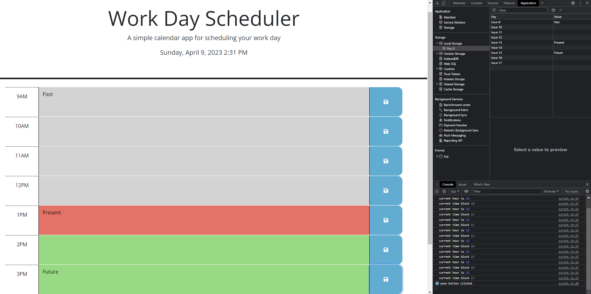

# work-day-scheduler

A daily planner that shows the past, current, and future time-blocks for the day.

## Techonologies Used

- HTML
- CSS
- JavaScript
- jQuery
- Day.js

## Desciptions

This daily planner shows the current day, date, and time in the header. Based on the time, the background color of each time-block will change to show which time-block was in the past, is present, and in the future. The text entered will be saved when the save button is clicked and still appear in the time-block even after the page has been refreshed.

## Visuals

## Installation

1. Clone the following repository: 
https://github.com/coding-boot-camp/crispy-octo-meme.git

2. Navigate to cloned repository to start coding.

## Deployed Page Link

https://adorahtho.github.io/work-day-scheduler/ 

## Author, Contributors, & Credits

- UW Coding Bootcamp
- @thoak90codes
- https://day.js.org/en/ 
- https://api.jquery.com/ 
